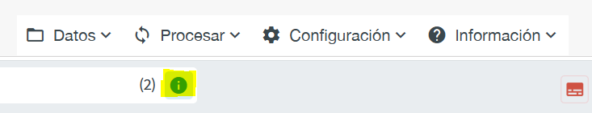
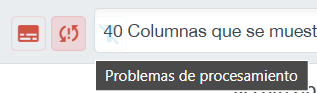

# Guía del usuario de DORIS versión de escritorio

DORIS versión de escritorio es una herramienta informática diseñada para el procesamiento por lotes eficiente de los certificados de defunción. Permite analizar grandes volúmenes de datos sobre diagnósticos, tanto en formato codificado como en formato de texto. El diseño del software prioriza la facilidad de uso, permitiendo importar certificados en diversos formatos como el CMCD electrónico en JSON, Excel y CSV. 

DORIS versión de escritorio requiere un `conjunto de datos de DORIS` para funcionar. Puede importar certificados desde un archivo en cualquiera de los formatos compatibles. Una vez importado, el archivo se guarda como `conjunto de datos de DORIS`. Cualquier acción realizada en el programa a partir de este momento utiliza el `conjunto de datos de DORIS`. Por ejemplo, si utiliza el botón `Procesar`, el software calcula la causa básica de defunción para todos los certificados y guarda esta información en el conjunto de datos, que se conserva para futuras sesiones. Para continuar al punto donde lo dejó, puede volver a abrir un conjunto de datos DORIS desde el menú `Abrir conjunto de datos de DORIS`. 

También puede `Exportar` los certificados de un `conjunto de datos de DORIS` en formatos compatibles.

## Importar datos
Puede importar certificados utilizando uno de los formatos de archivo compatibles. En los siguientes enlaces encontrará información sobre los formatos y archivos de muestra:

- Descripción detallada del [formato tabular para archivos Excel y CSV](csv-excel-format.md)

- Descripción detallada del [formato JSON estructurado](json-format.md)

Para importar un archivo, seleccione la opción `Importar archivos .xlsx, .csv o .json` en el menú `Datos`. A continuación, deberá elegir el archivo que desea importar. Después, la herramienta le pedirá un nombre para el `conjunto de datos de DORIS` que se creará. Por defecto, los conjuntos de datos de DORIS se guardan en la carpeta Documentos de Windows. 

Después de nombrar el archivo y hacer clic en `De acuerdo`, DORIS importará el archivo y mostrará su contenido. Si el archivo es grande y tarda en cargarse, el sistema mostrará una barra de progreso en la parte inferior de la pantalla.

## Trabajar con un conjunto de datos de DORIS
DORIS versión de escritorio trabaja con conjuntos de datos DORIS, que se crean tras importar datos en un formato de archivo compatible. Por defecto, los conjuntos de datos de DORIS se guardan en la carpeta Documentos de Windows. Esta ubicación puede modificarse en el menú `Configuración`/`Cambiar la carpeta predeterminada`.

### Abrir un conjunto de datos
Puede abrir un conjunto de datos DORIS existente desde el menú `Datos`/`Abrir conjunto de datos de Doris`. 

### Información del conjunto de datos
Una vez abierto un conjunto de datos, puede consultar su información mediante el botón `Datos` o el menú `Información del conjunto de datos`. 

Esta información incluye el número de certificados, si los datos están codificados o en formato de texto libre, si se han procesado, y otros detalles sobre el conjunto de datos. A continuación se muestra un ejemplo:

### Trabajar con certificados en formato de texto
Si los datos importados no están codificados, sino que contienen descripciones textuales, la herramienta asignará automáticamente códigos mediante el procesamiento de texto a código durante la fase de importación. Este proceso coloca los códigos asignados automáticamente en la columna `Código (auto)` junto con una columna adicional, `Coincidencia`, que indica la calidad de la conversión de texto a código.

Se recomienda que las conversiones automáticas de texto a código sean revisadas por expertos, especialmente cuando la coincidencia no sea una `Buena coincidencia` 

.

El botón de problemas de conversión de texto a código se puede utilizar para filtrar aquellos casos con resultados de conversión que no sean una buena coincidencia. 

### Procesamiento del conjunto de datos (detección de la causa básica de defunción)

El procesamiento del archivo calculará la causa básica de defunción para cada certificado. Esto se realiza en el menú `Procesar`. 

Si el conjunto de datos es grande, el sistema mostrará una barra de progreso en la parte inferior de la pantalla para indicar el avance.

Una vez finalizado el procesamiento, los resultados aparecen en la columna `Causa básica de defunción (CBD)`. Si la causa básica de defunción corresponde a varios códigos poscoordinados, se mostrará en la columna `CBD con información de poscoordinación`. Los certificados rechazados se indican en la columna `Rechazado` y los errores y advertencias se muestran en las columnas `Error` y `Advertencias`.

 Los certificados que han sido rechazados o presentan otros problemas pueden filtrarse fácilmente utilizando el botón de problemas de procesamiento.   

### Filtrado y clasificación
Para ordenar los certificados según los valores de una columna seleccionada, haga clic en la etiqueta de la columna. 

Para aplicar filtros, puede utilizar los iconos de filtro ubicados cerca de las etiquetas de las columnas. 

### Edición de certificados individuales

Haga clic en el número de la columna `Id` para abrir el certificado en modo de vista completa. 

En el modo de vista completa, se muestra al usuario toda la información contenida en el certificado, así como la causa básica de defunción calculada 

Una vez abierto, el sistema no permite editar el certificado. Para poder editarlo, debe hacer clic en el botón de desbloqueo situado en la parte inferior. 

Una vez desbloqueado, puede editar el certificado. Las líneas correspondientes a afecciones sólo permiten códigos de la CIE-11 válidos. No es posible editar el diagnóstico textual, aunque se puede sobrescribir indicando los códigos correspondientes.

Una vez finalizada la edición, puede guardar los cambios con el botón `Guardar`. Si no guarda sus cambios, la herramienta los borrará al cerrar la vista completa.

Para cerrar el modo de vista completa, haga clic en la `X` situada en la esquina superior izquierda.

El botón `Procesar` en modo de vista completa volverá a procesar el certificado para calcular la causa básica de defunción. Esto solo se guardará haciendo clic en `Guardar`. 

También es posible procesar todos los certificados editados desde el menú `Procesar`, después de cerrar el modo de vista completa.

### Visualización del informe para certificados individuales

DORIS ofrece cuatro modos de visualización complementarios para apoyar la revisión, la validación y la capacitación:

**Reporte textual**: Esta visualización ilustra los pasos y las reglas de mortalidad que se aplicaron para seleccionar la causa básica de defunción. Incluye un campo de **advertencias**, que señala cualquier incoherencia en la información proporcionada o sugiere la necesidad de una verificación manual. Las advertencias se muestran en amarillo. Después de las advertencias, se presenta un informe conciso que resume los principales pasos aplicados. En la sección de resultados también se presenta un informe completo, para una comprensión más profunda.  Este informe exhaustivo ofrece una explicación completa de la secuencia seguida, junto con información detallada sobre las reglas de mortalidad y los pasos que se aplicaron o no durante la selección de la causa básica de defunción.

**Reporte tabular:** En esta visualización interactiva se muestran los pasos para la selección de la causa básica de defunción en forma de tabla. Haciendo clic en las filas se pueden seguir los pasos uno tras otro, de arriba a abajo, y las reglas aplicadas se resaltarán en el certificado

**Reporte de flujo de reglas:** Esta visualización muestra el informe como una secuencia de reglas aplicadas que conducen finalmente a la causa básica de defunción seleccionada.

**Reporte de secuencia de reglas:** Esta visualización del informe se muestra como una secuencia horizontal. Las reglas específicas aplicadas en cada paso se muestran en el orden en que se aplicaron, de la parte superior a la inferior de la pantalla.

## Configuración
### Cambiar el idioma
Es posible cambiar el idioma de la herramienta haciendo clic en el menú `Configuración`/`Cambiar idioma`. Al hacer clic, el sistema mostrará los idiomas disponibles en un nuevo cuadro de diálogo. 

El idioma actual se muestra en color naranja; para cambiar de idioma, haga clic en otro idioma.

\** IMPORTANTE \** Cambiar el idioma requiere una conexión a Internet si el idioma seleccionado no se ha utilizado anteriormente, ya que el sistema necesita descargar la CIE en ese idioma para habilitar el procesamiento de texto a código.

El sistema utiliza el idioma seleccionado para tres aspectos distintos: 
- La interfaz de usuario de la herramienta cambia al idioma seleccionado.
- Durante la importación, si los certificados contienen diagnósticos en formato de texto, se usa el idioma seleccionado para el procesamiento de texto a código.
- Durante el procesamiento para detectar la causa básica de defunción, los mensajes de advertencia se muestran en el idioma seleccionado.

\** IMPORTANTE \** Solo es posible cambiar el idioma antes de abrir una base de datos. Si desea cambiar el idioma, cierre la aplicación y vuelva a intentarlo antes de abrir una base de datos.

### Cambiar la versión de la CIE-11
De forma predeterminada, DORIS Desktop utiliza la versión más reciente publicada de la CIE-11.

Es posible usar otra versión de la CIE-11 durante el procesamiento de los certificados. Para ello, utilice el menú `COnfiguración`/`Cambiar versión de la CIE`.

DORIS es compatible con las versiones de la CIE-11 correspondientes al 2023 y el 2024.

IMPORTANTE: Cambiar la versión de la CIE requiere conexión a Internet si la versión seleccionada no se ha utilizado antes, ya que el sistema necesita descargarla.

### Cambiar la carpeta predeterminada para los conjuntos de datos de DORIS
Por defecto, los conjuntos de datos de DORIS se guardan en la carpeta Documentos de Windows. Puede cambiar la carpeta predeterminada desde el menú `Configuración`/`Cambiar la carpeta predeterminada`. 

## Exportar datos
La exportación de datos en los formatos admitidos puede realizarse desde el menú `Datos`/`Exportar xxxx` 

El sistema le preguntará dónde desea guardar el archivo y qué nombre asignarle.

Una vez exportado el archivo de salida de ANACoD, es necesario completar las columnas con información nacional o local sobre la población, el año, el código ISO del país, etc., antes de importarlo a la herramienta ANACoD-3. [Más información sobre ANACoD-3](icd.who.int/anacod)
