# DORIS versión en línea

La versión en línea de DORIS es una aplicación web accesible a través de un navegador. Aplica las reglas de mortalidad de la CIE para seleccionar automáticamente la causa de defunción en certificados individuales. Puede acceder a la versión en línea [aquí](https://icd.who.int/doris/workspace/es). 

Es compatible con los 13 idiomas oficiales de la CIE-11: [árabe](https://icd.who.int/doris/ar), [chino](https://icd.who.int/doris/zh), [checo](https://icd.who.int/doris/cs), [eslovaco](https://icd.who.int/doris/sk), [español](https://icd.who.int/doris/es), [francés](https://icd.who.int/doris/fr), [inglés](https://icd.who.int/doris/en), [kazajo](https://icd.who.int/doris/kk), [portugués](https://icd.who.int/doris/pt), [ruso](https://icd.who.int/doris/ru), [sueco](https://icd.who.int/doris/sv), [turco](https://icd.who.int/doris/tr) y [uzbeko](https://icd.who.int/doris/uz). 

Para cambiar de idioma, utilice el botón de idioma situado en la esquina superior derecha de la pantalla. 

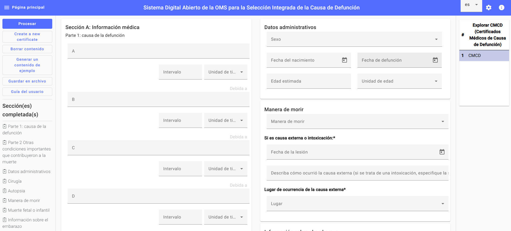

Proporcione la información requerida sobre la persona fallecida.

**Datos administrativos**: Complete los siguientes campos: sexo, fecha de nacimiento, fecha de defunción y edad estimada (en años, meses, semanas, días, horas, minutos o segundos), o seleccione «desconocido».

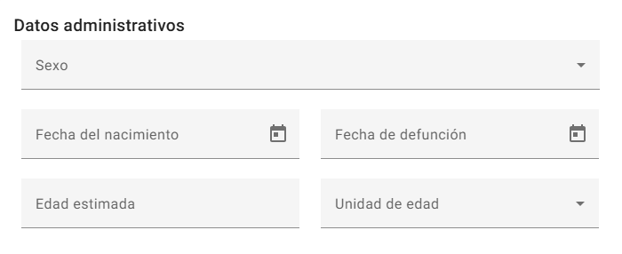

En la sección A, los campos de **Información médica** están vinculados a la herramienta de codificación de la CIE-11, lo que permite a los usuarios buscar por término o por código de la CIE-11.

Parte 1: Causa(s) de defunción. Complete las líneas a, b, c y d junto con sus intervalos de tiempo correspondientes. 

Parte 2: Indique otras condiciones o problemas de salud importantes que contribuyeron a la muerte, junto con sus intervalos de tiempo correspondientes. En esta sección, a cada problema de salud se le puede asignar un intervalo de tiempo distinto. Para ello, el usuario debe buscar el término o código de la CIE-11 usando la herramienta de codificación y, a continuación, asignar el intervalo de tiempo correspondiente.

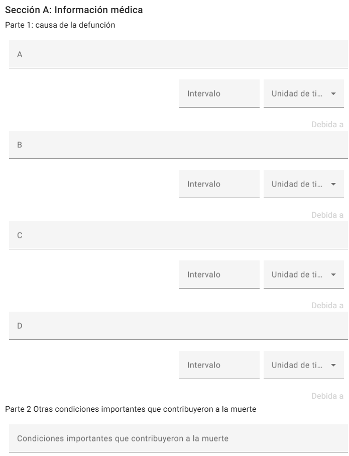

La parte 2 consta de los siguientes campos:

**Cirugía**: Proporcione toda la información relevante sobre las intervenciones quirúrgicas practicadas a la persona que falleció.

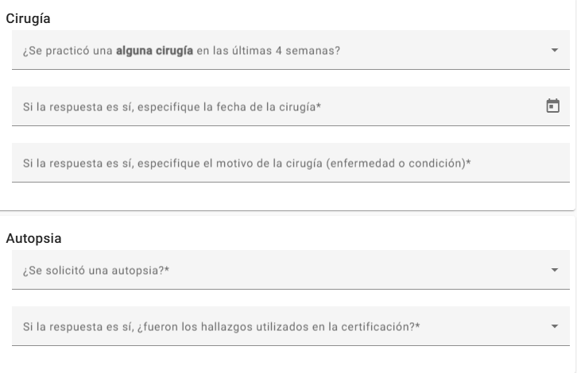

**Manera de morir**: Especifique cómo se produjo la muerte (por ejemplo, si fue por una enfermedad, accidente, lesión autoinfligida, agresión, etc.).

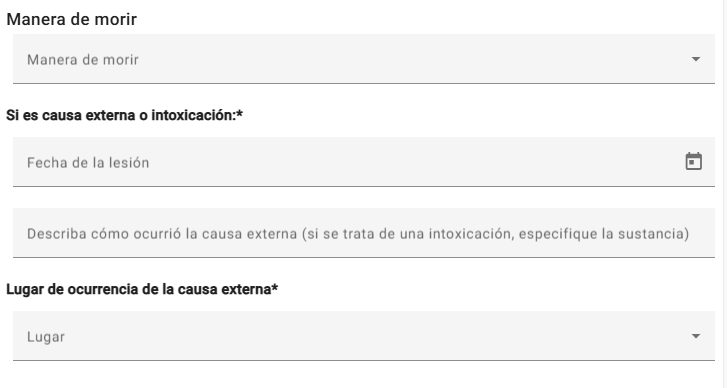

**Lugar de ocurrencia** de la causa externa: Especifique el lugar donde se produjo la causa externa (por ejemplo, en casos de accidente o lesión). Esta información es esencial para documentar con precisión las circunstancias en las que se produjo la muerte.

**Muerte fetal o infantil**: Complete los datos requeridos sobre embarazo múltiple o muerte fetal, especificando el número de horas de vida si procede, el peso al nacer, el número de semanas completas de embarazo y la edad de la madre. Si la muerte fue perinatal, anote las condiciones de la madre que afectaron al feto y neonato. 

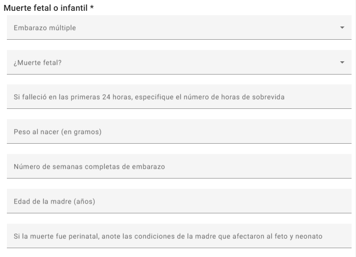

En el caso de las mujeres: 

**Estado en cuanto al embarazo**: ¿La fallecida estaba embarazada cuando ocurrió la muerte? Seleccione la opción correcta. 

**Tiempo desde el embarazo**: Si la persona fallecida estaba embarazada, indique el tiempo transcurrido desde el embarazo.

**Contribución del embarazo a la muerte**: Especifique si el embarazo influyó en la muerte de la persona. 

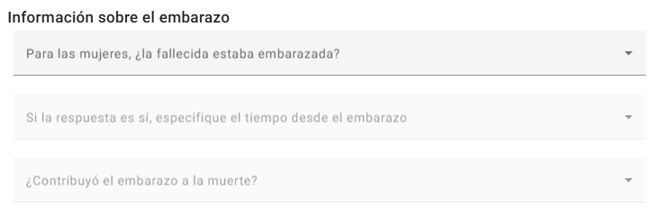

El botón **contenido de ejemplo** proporciona casos que demuestran cómo funciona la versión en línea de DORIS. Los usuarios pueden consultar estos casos de muestra para saber cómo utilizar la versión en línea.

Además, se agregó el botón **borrar contenido**. Al hacer clic en este botón, los usuarios pueden iniciar un nuevo certificado de defunción con todos los campos vacíos, y así comenzar una nueva entrada sin datos previos.

Para procesar la causa básica de defunción, los usuarios simplemente deben hacer clic en el botón "**Procesar**". Esta acción generará la información necesaria en función de los datos introducidos, ayudando a los usuarios a seleccionar la causa básica de defunción.

En la versión en línea es posible completar y procesar varios certificados médicos de causa de defunción (CMCD) en una misma sesión. Para consultar el resultado de un certificado concreto, vaya a la sección "Explorar CMCD" en la parte superior derecha de la pantalla y haga clic en el CMCD correspondiente para visualizar los datos procesados.

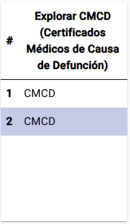

**Sección de resultados** 

Una vez seleccionada la **causa básica de** defunción, esta se presentará en la sección de **resultados** o datos de salida, que incluye dos campos relacionados con la **causa básica de defunción.** El primer campo representa la causa básica única de defunción seleccionada a partir de la información suministrada y se resalta en amarillo para llamar la atención de los usuarios. Además, si está disponible, la sección de resultados también incluye un campo para la codificación en grupos (clusters) con múltiples **causas de defunción**. Este campo indica los códigos poscoordinados, si procede, lo que aporta mayor contexto y más detalles. 

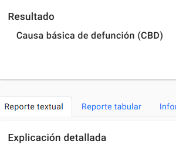

DORIS ofrece cuatro modos de visualización complementarios para brindar apoyo en la revisión, la validación y la capacitación:

**Reporte textual**: Este modo de visualización ilustra los pasos y las reglas de mortalidad que se aplicaron para seleccionar la causa básica de defunción. Incluye un campo de **alertas**, que señala cualquier incoherencia en la información proporcionada o indica que es necesario hacer una verificación manual. Las alertas se muestran en amarillo. Después de las alertas, se presenta un informe corto que resume los principales pasos aplicados. En la sección de resultados también se presenta un informe completo, para una comprensión más profunda. Este informe exhaustivo ofrece una explicación completa de la secuencia registrada, junto con información detallada sobre las reglas de mortalidad y los pasos que se aplicaron o no durante la selección de la causa básica de defunción.

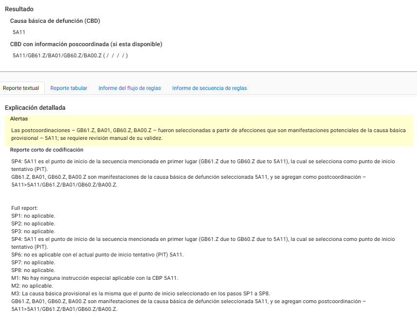

**Reporte tabular:** En esta visualización interactiva se muestran los pasos para la selección de la causa básica de defunción en forma de tabla. Haciendo clic en las filas se pueden seguir los pasos uno tras otro, de arriba a abajo, y las reglas aplicadas se resaltarán en el certificado

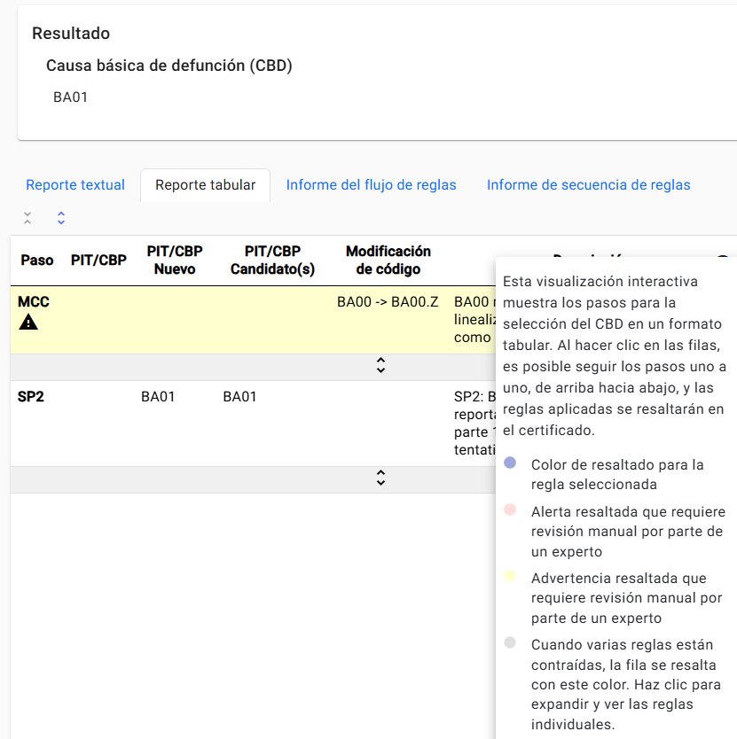

**Informe de flujo de reglas:** En esta visualización se muestra el informe como una secuencia de reglas aplicadas que conducen finalmente a la causa básica de defunción seleccionada.

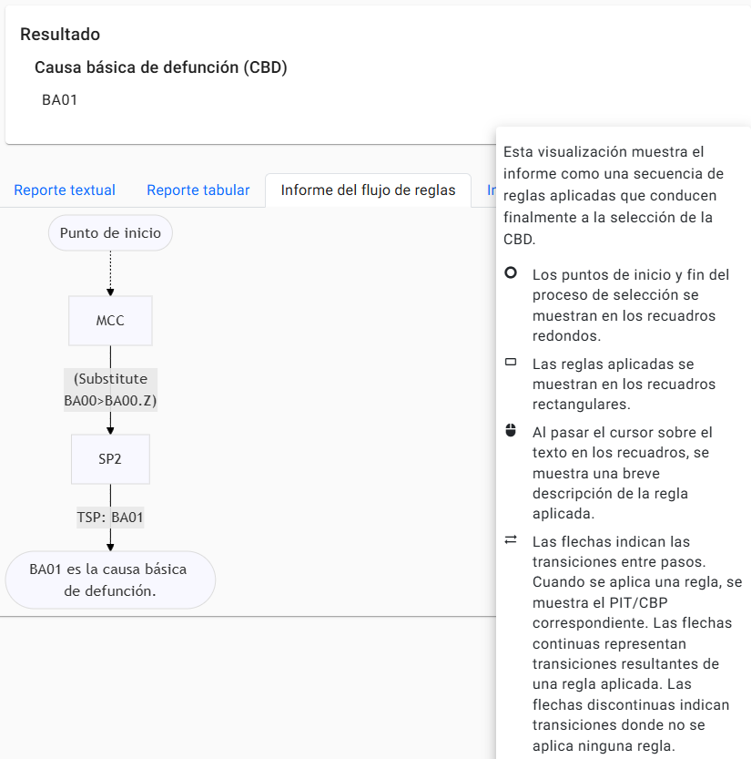

**Informe de secuencia de reglas:** Esta visualización del informe se muestra como una secuencia horizontal. Las reglas específicas aplicadas en cada paso se muestran en el orden en que se aplicaron, de la parte superior a la inferior de la pantalla.

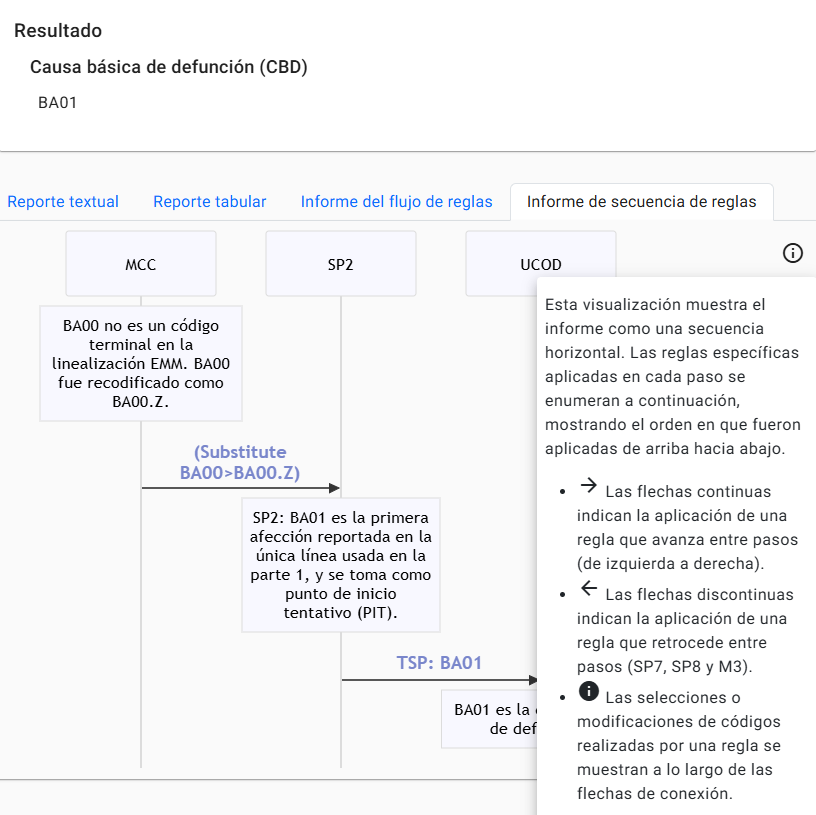

