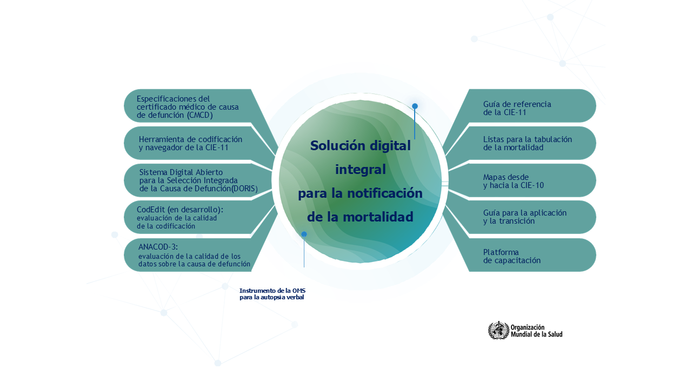

# Solución digital integral de la CIE-11 para la notificación de la mortalidad

Como parte de la solución digital integral de la CIE-11 para la notificación de mortalidad, la OMS ha desarrollado un conjunto de herramientas digitales sobre la causa de defunción, compuesto por programas que ayudan a codificar, seleccionar la causa básica única de defunción y evaluar la calidad de la codificación o de los datos. Estas herramientas digitales están diseñadas para mejorar la precisión y la eficiencia en la notificación de mortalidad, garantizando información estandarizada y fiable sobre la causa de defunción.

 > Se puede acceder a más programas informáticos y herramientas a través de [la página de la OMS sobre causas de defunción](https://www.who.int/es/standards/classifications/classification-of-diseases/cause-of-death) o [la página de inicio de la CIE-11](https://icd.who.int/es). 

## Certificado médico de causa de defunción (CMCD electrónico)

El certificado médico de causa de defunción es la base para recopilar información sobre las causas de muerte. El formulario está diseñado para recoger todos los aspectos relevantes al asignar la causa de muerte, y es independiente de la versión de la CIE. Además del formulario en papel que se presenta en la sección 3.14, se proporcionan las especificaciones técnicas para un formulario digital. Estas especificaciones permiten estandarizar la entrada de datos conforme al formulario modelo e incluyen un diccionario de datos con los nombres de los campos y la codificación del contenido, lo que permite procesar la información mediante la API de codificación, así como con el software de selección de la causa básica de defunción.

## Navegador y herramienta de codificación de la CIE-11

La CIE-11 ofrece un navegador conocido como el “navegador azul” y una herramienta inteligente de codificación. Estas herramientas, disponibles en varios idiomas y accesibles desde la página principal de la CIE-11, permiten a los usuarios buscar diagnósticos, términos índice, conceptos, elementos anatómicos, sinónimos u otros elementos contenidos en la CIE-11.

 > Para obtener más información, haga clic [aquí](https://icd.who.int/browse).

## Sistema Digital Abierto de la OMS para la Selección Integrada de la Causa de Defunción

La herramienta DORIS está diseñada para ayudar en la selección automatizada de la causa básica de defunción. Puede utilizarse en línea o sin conexión, y admite tanto texto libre como conjuntos de datos codificados según la CIE-11. Para que el software pueda hacer el procesaimiento, se digitalizaron las reglas de mortalidad de la CIE descritas en la sección 2.21 de la _Guía de referencia_, lo que dio lugar al conjunto de reglas digitales de mortalidad de la CIE-11. Si necesita ayuda para utilizar la herramienta, envíe un correo electrónico a icd@who.int.

 > Para obtener más información, haga clic [aquí](https://icd.who.int/doris/es). 

## Análisis de mortalidad y causas de muerte, versión 3 (ANACoD-3)
Este software realiza un análisis exhaustivo y sistemático de los datos de mortalidad y causas de defunción. ANACoD-3 analiza datos a nivel subnacional para identificar posibles problemas relacionados con la equidad en la salud o patrones de brotes. También permite analizar datos a lo largo de varios periodos de tiempo para examinar tendencias, y posibilita el análisis de datos de causas de defunción codificados tanto en el formato de la CIE-10 como en el de la CIE-11. Está disponible en varios idiomas. Si necesita ayuda para utilizar la herramienta, envíe un correo electrónico a mortality@who.int.

 > Para obtener más información, haga clic [aquí](https://icd.who.int/anacod).

## CodEdit

Un software que ayuda a quienes generan estadísticas sobre causas de defunción a fortalecer su capacidad para realizar comprobaciones rutinarias de plausibilidad en la codificación de datos. Permite analizar datos sobre causas de defunción codificados en el formato de la CIE-10 y en el de la CIE-11.

 > Para obtener más información, haga clic [aquí](https://www.who.int/standards/classifications/classification-of-diseases/services/codedit-tool#/upload).

# Causa de defunción: otros recursos disponibles 

## Recomendaciones de la OMS para realizar la inspección externa de un cadáver y completar el Certificado Médico de Causa de Defunción
Es un documento que ofrece recomendaciones sobre cómo realizar la inspección externa de un cadáver y completar el certificado médico de causa de defunción (CMCD), utilizando el modelo internacional de certificado médico de causa de defunción de la OMS del 2016.

 > Para obtener más información, haga clic [aquí](https://www.who.int/es/publications/m/item/who-recommendations-for-conducting-an-external-inspection-of-a-body-and-filling-in-the-medical-certificate-of-cause-of-death).

### Folleto de certificación de defunción: Una guía para los médicos certificadores

En este folleto se resumen las recomendaciones de la OMS dirigidas a los médicos certificadores con el fin de promover buenas prácticas en la certificación médica de la causa de defunción. Se describe el proceso de certificación médica, que incluye la confirmación de la muerte, el examen del cadáver, la determinación de las circunstancias y la causa de la muerte, y el llenado del certificado médico de causa de defunción (CMCD). 

 > Para obtener más información, haga clic [aquí](https://www.who.int/es/publications/m/item/cause-of-death-certification-flyer---a-tool-for-certifying-physicians).

### Herramienta interactiva de autoaprendizaje de la OMS

La herramienta interactiva de la OMS está diseñada tanto para el autoaprendizaje como para su uso en el aula. Su estructura modular permite adaptar los cursos a diferentes grupos de usuarios, ofreciendo trayectorias formativas personalizadas si se desea. La herramienta incluye dos módulos relacionados con la mortalidad.

 > Para obtener más información, haga clic [aquí](https://icd.who.int/training/icd10training/ICD-10%20Death%20Certificate/html/index.html).

### Folleto sobre la causa de defunción: Guía de referencia rápida

Este folleto sirve como guía de referencia rápida sobre el certificado de defunción y sigue las reglas de mortalidad establecidas en la Clasificación Internacional de Enfermedades (CIE). En este resumen se presentan los puntos clave que deben tenerse en cuenta a la hora de certificar la causa de defunción con exactitud.

> Para obtener más información, haga clic [aquí](https://cdn.who.int/media/docs/default-source/classification/icd/cause-of-death/causeofdeathflyer_2015.pdf?sfvrsn=9ec05f86_1#/upload).
